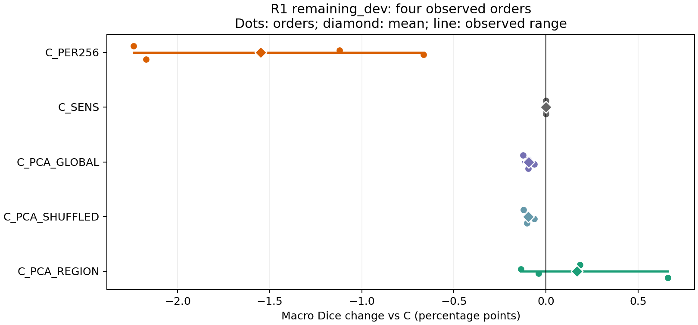

# R1 Recovery / Target Subspace 实验报告

**R1_EXPERIMENT_COMPLETE：24/24 条轨迹、3/3 次设备 smoke 与独立 CPU 汇总全部完成，所有 27 个计算子进程和启动器退出码均为 0。**

主要结论：保留 C 作为当前基线。固定周期恢复在四个顺序上均下降；敏感性恢复未触发，评分与 C 完全相同；区域 PCA 的四序平均提升仅 **0.169 pp**，且只有 **2/4** 顺序改善。GLOBAL 和 SHUFFLED 均轻微下降。区域结构有小幅描述性信号，但本轮不足以确认稳定收益。

## 1. 执行与数据口径

- 运行时间：北京时间 2026-09-12 19:52:51 至 2026-09-13 00:07:22。
- 执行 SHA：[`54c4ca4fc2672d3da37e1f70d3c8ab7ac6bad31b`](https://github.com/DLwbm123/DPA-CTTA/commit/54c4ca4fc2672d3da37e1f70d3c8ab7ac6bad31b)；报告提交另列于交付链接，不替代执行 SHA。
- GPU 4、6、7，均 RTX 3090；最多 3 worker，每卡一个，按冻结轮换分配。共享 GPU 的负载不受控。
- 一份给定 checkpoint；无源图像/mask/代理/原型、额外预训练或源训练。图像按当前到达顺序处理，固定预测后才读当前 mask。
- 每序完整 1,951 组；主要终点使用已暴露开发集 remaining_dev 的 1,695 组。先每图 OD/OC 平均，再各域平均，最后四域等权；四序再作描述性平均。
- pp 是 Dice 百分点。四个顺序重复使用相同内容，不能作为四组独立患者重复；未计算显著性或置信区间。

| order | 域序 |
| --- | --- |
| 0 | REFUGE → ORIGA → REFUGE_Valid → Drishti_GS |
| 1 | Drishti_GS → REFUGE_Valid → ORIGA → REFUGE |
| 2 | ORIGA → Drishti_GS → REFUGE → REFUGE_Valid |
| 3 | REFUGE_Valid → REFUGE → Drishti_GS → ORIGA |

## 2. 主要终点：remaining_dev

| 方法 | OD % | OC % | Macro % | ΔC pp | 改善顺序 | 最差顺序 % | 顺序范围 pp |
| --- | --- | --- | --- | --- | --- | --- | --- |
| C | 87.348 | 69.874 | 78.611 | 0.000 | 0/4 | 78.006 | 1.320 |
| C_PER256 | 85.352 | 68.770 | 77.061 | -1.550 | 0/4 | 76.865 | 0.478 |
| C_SENS | 87.348 | 69.874 | 78.611 | 0.000 | 0/4 | 78.006 | 1.320 |
| C_PCA_GLOBAL | 87.299 | 69.734 | 78.517 | -0.095 | 0/4 | 77.912 | 1.317 |
| C_PCA_SHUFFLED | 87.297 | 69.733 | 78.515 | -0.096 | 0/4 | 77.908 | 1.315 |
| C_PCA_REGION | 87.294 | 70.266 | 78.780 | 0.169 | 2/4 | 77.872 | 2.118 |

区域 PCA 相对 C 的 OD 为 −0.054 pp、OC 为 +0.392 pp；平均增益主要来自 OC。其顺序范围从 C 的 1.320 pp 扩大至 2.118 pp，最差观察顺序得分比 C 的最差顺序低 0.135 pp。

| 方法 | order0 | order1 | order2 | order3 |
| --- | --- | --- | --- | --- |
| C | 79.104 | 78.006 | 78.008 | 79.326 |
| C_PER256 | 76.865 | 76.884 | 77.343 | 77.153 |
| C_SENS | 79.104 | 78.006 | 78.008 | 79.326 |
| C_PCA_GLOBAL | 78.980 | 77.912 | 77.944 | 79.229 |
| C_PCA_SHUFFLED | 78.982 | 77.908 | 77.946 | 79.224 |
| C_PCA_REGION | 79.290 | 77.872 | 77.969 | 79.989 |

| 配对差值 pp | order0 | order1 | order2 | order3 | 四序均值 |
| --- | --- | --- | --- | --- | --- |
| C_SENS − C | 0.000 | 0.000 | 0.000 | 0.000 | 0.000 |
| C_PER256 − C | -2.239 | -1.122 | -0.665 | -2.173 | -1.550 |
| C_SENS − C_PER256 | 2.239 | 1.122 | 0.665 | 2.173 | 1.550 |
| C_PCA_GLOBAL − C | -0.124 | -0.094 | -0.064 | -0.097 | -0.095 |
| C_PCA_SHUFFLED − C | -0.122 | -0.098 | -0.062 | -0.102 | -0.096 |
| C_PCA_REGION − C | 0.186 | -0.135 | -0.039 | 0.663 | 0.169 |
| C_PCA_REGION − C_PCA_GLOBAL | 0.310 | -0.041 | 0.025 | 0.760 | 0.263 |
| C_PCA_REGION − C_PCA_SHUFFLED | 0.308 | -0.037 | 0.023 | 0.766 | 0.265 |

REGION 对 GLOBAL 和 SHUFFLED 分别为 +0.263、+0.265 pp，均在 3/4 顺序上占优，但 order1 仍为负。C_SENS 超过周期恢复只是因为周期恢复损害 C；不能据此归因为敏感性触发有效。

图中横线为四个观察顺序的最小至最大差值，圆点为各序，菱形为均值；横线不是置信区间。

## 3. 域差异、配对尾部与 ASSD

| 配对 Macro Δ pp | REFUGE | ORIGA | REFUGE_Valid | Drishti_GS |
| --- | --- | --- | --- | --- |
| C_SENS − C | 0.000 | 0.000 | 0.000 | 0.000 |
| C_PER256 − C | -0.932 | -5.971 | 3.840 | -3.137 |
| C_SENS − C_PER256 | 0.932 | 5.971 | -3.840 | 3.137 |
| C_PCA_GLOBAL − C | -0.002 | -0.081 | -0.231 | -0.064 |
| C_PCA_SHUFFLED − C | -0.001 | -0.087 | -0.227 | -0.069 |
| C_PCA_REGION − C | -0.190 | 0.390 | -0.464 | 0.938 |
| C_PCA_REGION − C_PCA_GLOBAL | -0.188 | 0.471 | -0.232 | 1.003 |
| C_PCA_REGION − C_PCA_SHUFFLED | -0.189 | 0.477 | -0.236 | 1.008 |

周期恢复损害集中在 ORIGA（−5.971 pp）和 Drishti_GS（−3.137 pp），虽然 REFUGE_Valid 增加 3.840 pp，仍无法抵消其他域退化。区域 PCA 在 ORIGA、Drishti_GS 改善，在 REFUGE、REFUGE_Valid 下降。

remaining_dev 的四域分别为 336、586、736、37 组，主终点仍按冻结定义各占 25%。Drishti_GS 样本少而改善较大，需要结合这一权重理解区域 PCA 的小幅总增益。

| 配对 | 域 | OD 最差10% Δpp | OC 最差10% Δpp | OC下降比例 % | OC共同有效 ASSD Δpx | OC有效配对 n（o0/o1/o2/o3） |
| --- | --- | --- | --- | --- | --- | --- |
| C_PER256 − C | REFUGE | -6.693 | -5.900 | 36.682 | -0.346 | 336/336/336/336 |
| C_PER256 − C | ORIGA | -22.190 | -32.050 | 70.265 | 2.592 | 586/586/586/586 |
| C_PER256 − C | REFUGE_Valid | -3.538 | -2.995 | 8.730 | -1.940 | 736/736/736/736 |
| C_PER256 − C | Drishti_GS | -5.867 | -6.106 | 57.432 | 1.099 | 37/37/37/37 |
| C_PCA_REGION − C | REFUGE | -0.191 | -1.751 | 60.045 | 0.228 | 336/336/336/336 |
| C_PCA_REGION − C | ORIGA | -0.212 | -1.159 | 17.363 | -0.375 | 586/586/586/586 |
| C_PCA_REGION − C | REFUGE_Valid | -0.581 | -1.277 | 93.444 | 0.454 | 736/736/736/736 |
| C_PCA_REGION − C | Drishti_GS | -0.082 | -0.681 | 7.432 | -0.922 | 37/37/37/37 |

尾部列为各序逐图配对差值最差十分位均值，再对四序取平均；下降比例同样为四序平均。ASSD 仅使用两方法共同定义的图像，正值表示恶化；各序缺失/空预测、正负计数及全部 OD/OC/Macro 分布均保留在 [PAIRED_DISTRIBUTIONS.csv](PAIRED_DISTRIBUTIONS.csv) 和 [原聚合](public_aggregate.json)。不把无定义 ASSD 当作 0，也未重建未保存的边界几何。

## 4. 其他已暴露开发子集

| 方法 | remaining_dev Macro % | legacy_dev Macro % | p1_extension_dev Macro % | all_dev Macro % |
| --- | --- | --- | --- | --- |
| C | 78.611 | 78.675 | 79.120 | 78.836 |
| C_PER256 | 77.061 | 77.251 | 77.142 | 77.283 |
| C_SENS | 78.611 | 78.675 | 79.120 | 78.836 |
| C_PCA_GLOBAL | 78.517 | 78.588 | 79.039 | 78.747 |
| C_PCA_SHUFFLED | 78.515 | 78.585 | 79.038 | 78.745 |
| C_PCA_REGION | 78.780 | 78.778 | 79.248 | 78.964 |

legacy_dev 与 p1_extension_dev 各 128 组，all_dev 为完整 1,951 组；all_dev 与各子集重叠。各序的 OD/OC/Macro 完整表见 [ORDER_SUBSET.csv](ORDER_SUBSET.csv)，逐域同类表见 [DOMAIN_SCORES.csv](DOMAIN_SCORES.csv)。

## 5. 恢复与 PCA 机制

C_PER256 每条轨迹均恢复 7 次，位置固定为 257、513、769、1025、1281、1537、1793；四序合计 28 次。C_SENS 四序均 0 次恢复、没有缺失 sensitivity。达到 age≥50 后，EMA/best 的各序最大值如下，均未达到严格大于 7 的冻结条件。

| order | 最大 EMA/best | 恢复次数 |
| --- | --- | --- |
| 0 | 3.517 | 0 |
| 1 | 3.302 | 0 |
| 2 | 3.259 | 0 |
| 3 | 3.319 | 0 |

因此本次敏感性探测没有改变 C 的恢复状态，却把每图前向数从 8 增加至 11（+37.5%）；不能把它与 C 的零分差称为成功恢复。

| order | 方法 | 任一 basis 可用 | 各 bank 可用次数 | 最终各 bank 样本 n | 最终 rank | 未加权子空间损失均值 |
| --- | --- | --- | --- | --- | --- | --- |
| 0 | C_PCA_GLOBAL | 1935/1951 | 1935 | 233545 | 8 | 0.087 |
| 0 | C_PCA_SHUFFLED | 1935/1951 | 1935/1935/1935/1935 | 62432/62431/62432/46250 | 8/8/8/8 | 0.087 |
| 0 | C_PCA_REGION | 1935/1951 | 1935/1935/1935/1935 | 62432/62431/62432/48118 | 8/8/8/8 | 0.106 |
| 1 | C_PCA_GLOBAL | 1935/1951 | 1935 | 227521 | 8 | 0.091 |
| 1 | C_PCA_SHUFFLED | 1935/1951 | 1935/1935/1935/1935 | 62432/62428/62432/40196 | 8/8/8/8 | 0.092 |
| 1 | C_PCA_REGION | 1935/1951 | 1935/1935/1935/1935 | 62432/62428/62432/42640 | 8/8/8/8 | 0.112 |
| 2 | C_PCA_GLOBAL | 1935/1951 | 1935 | 230421 | 8 | 0.093 |
| 2 | C_PCA_SHUFFLED | 1935/1951 | 1935/1935/1935/1929 | 62432/62413/62432/43129 | 8/8/8/8 | 0.093 |
| 2 | C_PCA_REGION | 1935/1951 | 1935/1935/1935/1929 | 62432/62413/62432/44048 | 8/8/8/8 | 0.112 |
| 3 | C_PCA_GLOBAL | 1935/1951 | 1935 | 222215 | 8 | 0.092 |
| 3 | C_PCA_SHUFFLED | 1935/1951 | 1935/1935/1935/1935 | 62432/62365/62432/34978 | 8/8/8/8 | 0.092 |
| 3 | C_PCA_REGION | 1935/1951 | 1935/1935/1935/1935 | 62432/62366/62432/39000 | 8/8/8/8 | 0.111 |

GLOBAL 为单 bank；REGION 的四 bank 顺序是 OD 背景、OD 前景、OC 背景、OC 前景；SHUFFLED 保留对应配额并打乱语义。任一 bank 可用比例均为 1935/1951（99.18%）；order2 的 OC 前景 bank 为 1929/1951（98.87%）。所有最终 rank 为 8。区域 PCA 的信号偏弱并非整个子空间分支未激活。缺少可靠 token、各 bank 的贡献图像数、状态字节、损失分布及触发位置见 [MECHANISM_AND_COST.json](MECHANISM_AND_COST.json)。

## 6. 实际预算、延迟与内存

| 项目 | 实测 |
| --- | --- |
| 正式记录 / Adam / backward | 46,824 / 46,824 / 46,824 |
| 正式前向 | 398,004 |
| 3卡 smoke Adam / backward / 前向 | 42 / 42 / 354 |
| 合计 Adam / backward / 前向 | 46,866 / 46,866 / 398,358 |
| 总 wall | 4.242 h |
| 累计 active worker | 9.159 h |
| 最长轨迹 | 39.170 min |
| 输出占用（沿用监督器计数口径） | 112.789 MiB |

| 方法 | host ms/图 | pipeline ms/图 | RGB+mask验证/解码总秒 | 峰值 allocated MiB |
| --- | --- | --- | --- | --- |
| C | 653.287 | 728.933 | 201.855 | 586.546 |
| C_PER256 | 628.161 | 702.741 | 202.104 | 588.623 |
| C_SENS | 703.026 | 778.643 | 204.683 | 588.624 |
| C_PCA_GLOBAL | 647.842 | 723.414 | 201.746 | 637.046 |
| C_PCA_SHUFFLED | 553.420 | 629.171 | 201.862 | 637.046 |
| C_PCA_REGION | 545.802 | 621.962 | 201.872 | 637.046 |

这里是实际共享设备条件下的观测时间，不是受控方法加速比；每个方法跨四序的设备分配也不是严格等频。host 包含既定适应步骤，pipeline 另含当前资产读取与 evaluator 等处理。内存列是 PyTorch peak allocated，不是整卡占用。每条轨迹的延迟分布、checkpoint 和 RGB/mask 验证 IO、smoke backend、真实退出码见 [EXECUTION_AUDIT.json](EXECUTION_AUDIT.json)。

## 7. 已绑定的历史次要参照

| 配对 Macro Δpp | order0 | order1 | order2 | order3 | 四序均值 |
| --- | --- | --- | --- | --- | --- |
| C − A | 4.845 | 3.463 | 3.530 | 5.324 | 4.291 |
| C − C0 | 4.025 | 2.927 | 2.928 | 4.247 | 3.532 |

A/C0 四序身份绑定均为 AVAILABLE；作为历史次要参照，未重跑旧方法。C0 沿用已核验的 stateless canonical 例外，再按各序配对。其余六臂与 A/C0 的逐域/子集/通道配对保留在原聚合。

## 8. 校验与交付边界

原执行器已完成冻结版本的独立 CPU 重算并原子发布有效结果。本次补表再次仅读取 scalar JSONL、完成记录与登记 metadata，复用冻结 `execution_evidence` / `validate`，检查全部 24 条的顺序/身份/控制器/PCA 标量、计数、GT metadata 和已发布均值；验证结果为 46,824 条一致、CUDA 未初始化。没有重新读取图像/mask/权重或运行模型。

补表脚本第一次把只含实际调用数的字典与含 trajectories/offline_updates 元数据的配置字典整体比较，造成报告检查 AssertionError；已改为对相同实际计数字段比较，CPU 补表通过。初次日志保留为 [CPU_REPORT_INITIAL_FAILURE_LOG.txt](CPU_REPORT_INITIAL_FAILURE_LOG.txt)，最终日志为 [CPU_CLOSEOUT_LOG.txt](CPU_CLOSEOUT_LOG.txt)。该问题不涉及原实验、原汇总或冻结运行代码；未重跑 GPU。

- science SHA256：`e23fb6de3e55f704ec2036d82777b29a78643ebc7e1ae1e89328f22f56de51e2`。
- registration digest：`8afb0a9ea4e5fe1701bd89a04778de1b2ef0fac70e7aa8ec62fe288f071ffeaf`。
- 公开：执行源码引用、CPU 报告生成脚本、去身份聚合、配对分布、预算证据、图表和本报告。
- 逐图身份/路径、registration、checkpoint、图像/mask 和原始逐图日志保持私有；公开审计省略设备 UUID/PID。未导出 PCA 特征/向量状态，公开 bank 数值仅为计数、rank、ready 等统计。
- 自动描述状态为 MIXED、candidate_routes 为空；它不代替外部研究选择，也不产生后续执行许可。

本批实验与结果交付结束，不追加组合、seed、域序、阈值调整或补跑。
