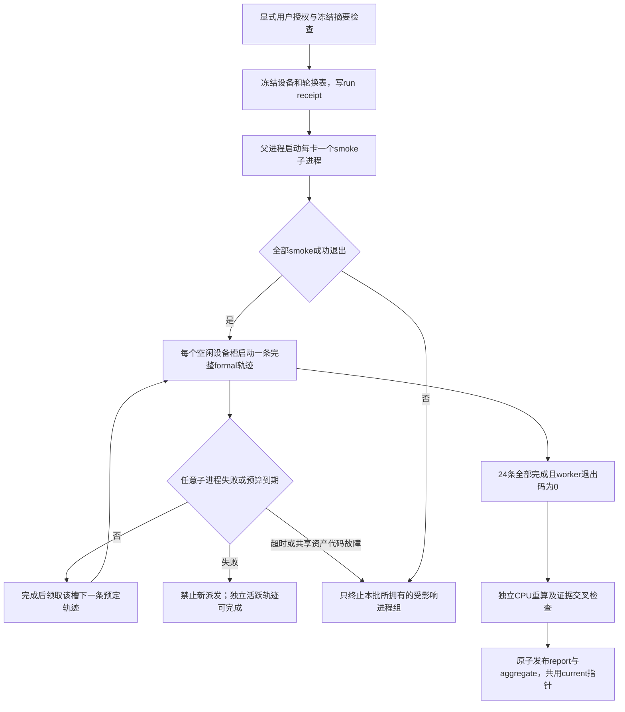

# R1有限进程监督与结果发布

算法状态仍遵循原[STATE_LIFECYCLE](../r1/STATE_LIFECYCLE.md)；本次只修复执行监督、身份绑定和审计。

当前没有启用此流程：execution保持关闭，没有GPU列表，没有背景等待器。监督循环仅存在于将来由用户显式启动的有限矩阵调用中。

父进程直接拥有全部smoke和formal子进程。每条formal轨迹使用新进程加载同一登记checkpoint，独立初始化全部状态；没有不受管理的formal孙进程或队列消费者。每个设备槽最多一条活跃轨迹，轨迹中途不换卡、不切样本、不使用DDP。进程命令行仍为中性Python入口，路径、job和设备绑定通过环境变量/私有packet提供。

所有子进程使用新的process group，创建后记录PID/PGID。父进程每轮检查所有子进程，及时发现后启动worker的失败。首次失败后禁止新派发；普通轨迹失败允许已经活跃且独立的轨迹结束。登记资产内容故障及共享不变量错误标明scope，停止本批共享这些资产/代码的活跃进程；不会查找或终止其他批次/用户的进程。保存已有JSONL前缀，写INCOMPLETE/TIMEOUT，不重试。

启动中途失败、SIGINT、SIGTERM或父进程异常进入finally收尾。信号handler只记录请求，在当前原子IO或Popen登记完成后的安全边界处理，避免在mkstemp/open中异步抛异常造成NFS活跃句柄遗留；清理期间忽略第二次中断。仅对仍由本次调用拥有的process group发送TERM，经过短暂宽限后KILL并回收；不会在24小时后按旧PID历史再次发信号。操作系统不可中断内核IO仍可能延迟实际回收；清理异常不得产生COMPLETE。

| 上限 | 实现 |
|---|---|
| 单formal轨迹2小时 | 父进程从创建子进程起计时，涵盖checkpoint、读图和GPU卡住；保留样本边界charge |
| 累计活跃24小时 | 累计本批活跃子进程的wall时间，含IO/加载；这是保守进程时间，不冒充GPU busy时间 |
| 总wall 24小时 | 父进程独立计时；stuck smoke同样受此上限和累计上限约束 |
| 私有输出2GiB | 监督阶段检查本输出树；CPU发布前计入待生成报告，超限不发布当前COMPLETE |
| CPU线程/并发 | 每worker两CPU线程；最多三个设备槽，无后台自动恢复 |

默认监督轮询间隔0.2秒，TERM宽限0.5秒；这些是收尾分辨率，不是新增科学参数或放宽预算。实际wall/active及未启动job列表保存在`matrix.processes.json`。

## 固定轮换与设备证据

`worker=(arm_index+order_index)%k`，执行前冻结。相同job只出现一次，单卡仍完成24条。

| worker数 | 每槽轨迹数 | 每槽正式前向 |
|---|---|---|
| 1 | 24 | 398004 |
| 2 | 12 / 12 | 199002 / 199002 |
| 3 | 8 / 8 / 8 | 130717 / 130717 / 136570 |

三卡的5853次前向差来自C_SENS四序在三槽的2/1/1分配，没有增加调用。每臂跨四序覆盖所有实际槽；每槽另计118次smoke前向、14次backward/Adam。正式总计仍为24条、46824条记录/Adam/backward、398004次前向。设备UUID、型号和backend记录在私有证据；混合型号明确披露，不能据此作受控加速比较。当前metadata计划未分配真实GPU，详见[DRY_RUN_MATRIX](DRY_RUN_MATRIX.json)。

## 共同身份与当前结果失效

run receipt、创建进程清单、退出状态、设备smoke、trajectory completion、每条记录共用run id、完整code SHA、science摘要、registration摘要；按层级追加worker/device UUID及job/arm/order。它们只是证据绑定，不是密码学审阅签名。

独立CPU重算核对完整24条、每设备smoke、所有退出码和failure标志；completion.records/physical必须与JSONL及job预算相符。由保存sensitivity重放controller，再比较每次trigger/reset/age/ema/best及恢复周期内计数。PCA核对bank数量、非负配额、累计n/贡献图、refresh/版本/rank、旧快照时间和状态字节数；不声称重建未保存的特征、基底或ASSD几何。

重算开始先将`current_result.json`置为无效并撤销current指针；旧版本保留在私有results目录。成功报告与aggregate先写入同一个完整版本目录，再原子切换current symlink，最后发布valid=true索引。重算失败则保持当前无效，根目录兼容链接不再指向旧COMPLETE；原JSONL不删除。摘要同时保留matched comparisons、risk、inactive和历史副对照状态，`assess`仅为描述性建议，不能代替外部研究选择。
